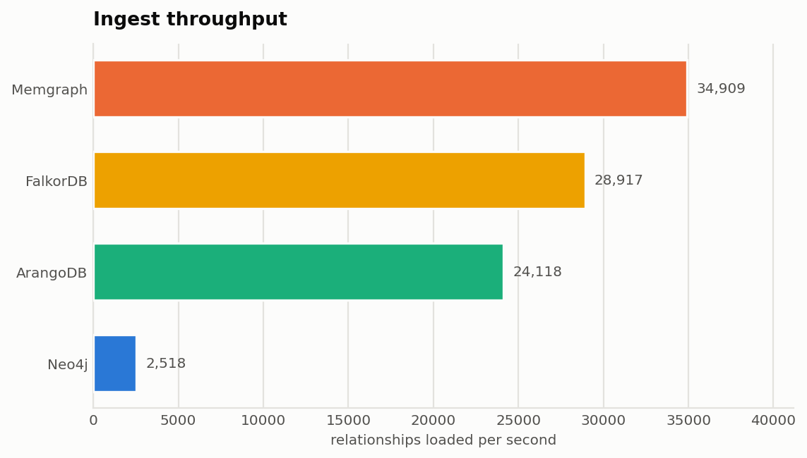
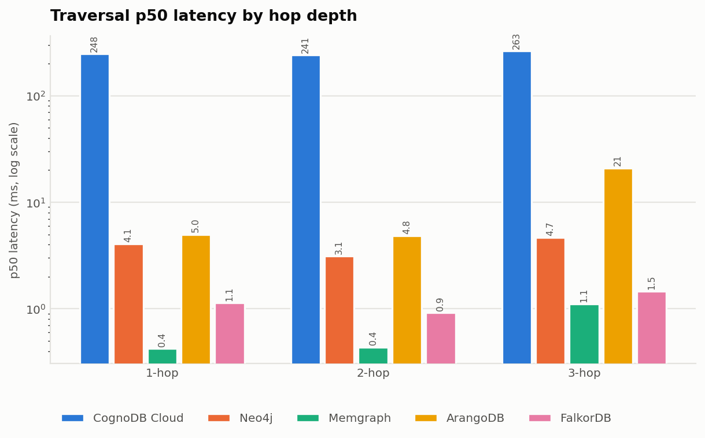
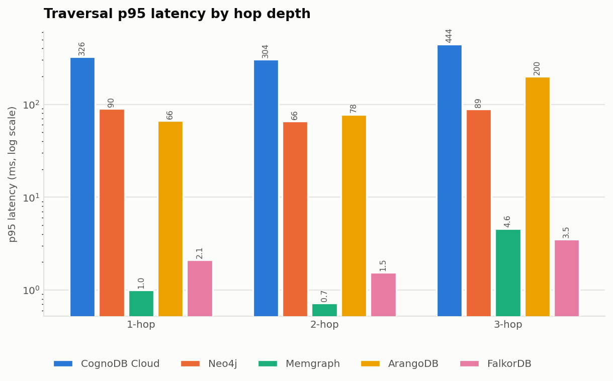
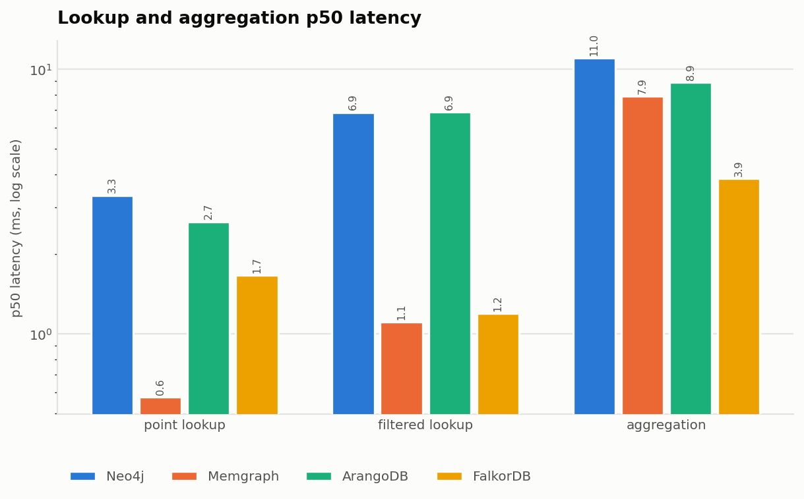
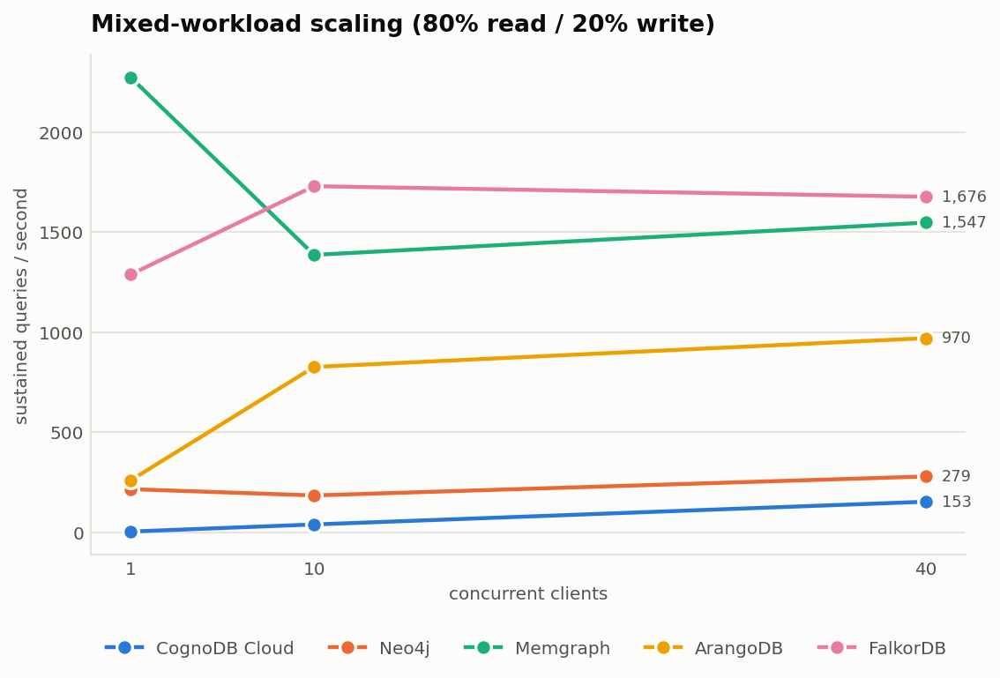

# Graph database cloud benchmark — CognoDB vs. four other engines

A reproducible, fully scripted benchmark comparing **CognoDB Cloud** against four
other graph databases on one dataset, one set of logical queries, one client
machine, and — the part that usually gets fudged — **one set of hardware limits**.

Everything here runs from `make all`. Every number in this README was produced by
that command; none was typed in by hand.

> **Scope of the published run:** the results below cover **four engines** —
> Neo4j, Memgraph, ArangoDB and FalkorDB. CognoDB is fully supported by the
> harness but no instance was provisioned, so it is reported as *not configured*
> rather than estimated. See [Caveats](#caveats).

> **On who "wins".** The interesting result in this benchmark is not the ranking.
> It is *why* engines that answer identical questions on identical hardware differ
> by two orders of magnitude — and the answer turns out to be mostly about where
> each engine spends its 256 MB. That reasoning is in [Analysis](#analysis).

---

## Contents

- [The fairness problem](#the-fairness-problem)
- [Databases compared, and why](#databases-compared-and-why)
- [Dataset](#dataset)
- [Methodology](#methodology)
- [How the harness avoids fooling itself](#how-the-harness-avoids-fooling-itself)
- [Reproducing this](#reproducing-this)
- [Results](#results)
- [Analysis](#analysis)
- [Caveats](#caveats)
- [Repository layout](#repository-layout)
- [Write-up](#write-up)

---

## The fairness problem

The CognoDB free tier is **0.5 burstable vCPU, 256 MB RAM, 1 GB disk**. That is
small. It is small enough that the obvious benchmark — CognoDB's free tier against
whatever tier the other vendors happen to offer — measures the *tier*, not the
*engine*. A database given 4 GB will beat one given 256 MB every time, and the
result tells you nothing.

So the constraint here runs the other way: **every engine is held to CognoDB's
free-tier envelope**, and that envelope is the unit of comparison.

| Resource | Parity tier |
|---|---|
| vCPU | 0.5 (burstable) |
| RAM | 256 MB |
| Disk | 1 GB |

The four comparison databases run as local containers with hard cgroup limits at
exactly those figures — `cpus: 0.5`, `memory: 256m` in
[`docker/docker-compose.yml`](docker/docker-compose.yml). Section 4 of the brief
explicitly permits "self-hosted deployments capped to the same resources", and
capping locally is in fact **stricter** than comparing cloud free tiers to each
other: a cloud tier advertises resources it does not always honour, and hides its
noisy-neighbour behaviour behind an endpoint you cannot inspect. A cgroup limit is
verifiable — `make stats` prints live usage against the cap.

The same harness runs unchanged against managed cloud endpoints. Set the URI
environment variables and it benchmarks those instead; nothing in the code knows
the difference.

### Where this parity is imperfect — stated up front

CognoDB is a **managed cloud instance reached over the public internet**, while
the four comparison engines are **local containers reached over loopback**. This
did not affect the published run, in which CognoDB was not configured and so was
not measured at all — but it will affect any run that includes it, and it is not
a difference the harness can eliminate:

- Every CognoDB measurement includes a network round trip that the local
  platforms do not pay. On sub-millisecond workloads — point lookups especially —
  that round trip can *exceed* the query itself.
- "0.5 burstable vCPU" on managed hardware and `cpus: 0.5` under cgroups are
  similar in intent but not identical in behaviour, particularly in how burst
  credit accrues.

Both effects push in the same direction: **they make CognoDB look slower than its
engine is**. Read the CognoDB row as an upper bound on latency, not a measurement
of the engine in isolation. The honest way to remove this asymmetry is to
benchmark managed endpoints for all five platforms from the same client region,
which the harness supports and which is the natural next run.

---

## Databases compared, and why

Picking four Neo4j-compatible databases would have produced a tidy table and taught
nothing — it would compare implementations of one design. The selection here spans
**three storage architectures and two query languages**, so that differences in the
results have a chance of being interesting.

| Database | Engine design | Query language | Why it is here |
|---|---|---|---|
| **CognoDB Cloud** | Managed, Bolt-compatible | Cypher | The subject of the benchmark. Free c0 tier, driven by the official Neo4j driver with no code changes. |
| **Neo4j 5.26** | JVM, native graph store, page cache | Cypher | The reference implementation and the thing every Bolt database is compatible *with*. Without it there is no baseline. |
| **Memgraph 2.22** | C++, in-memory transactional | Cypher | Same language and protocol as Neo4j, completely different runtime. Isolates "JVM vs. native" from "Cypher vs. not". |
| **ArangoDB 3.11** | Multi-model, document store with edge indexes | **AQL** | The only non-Cypher engine here. Tests whether the harness's fairness claim survives a genuine language boundary. |
| **FalkorDB 4.2** | Sparse adjacency matrices, GraphBLAS, inside Redis | Cypher | Architecturally the furthest from the rest: traversal is linear algebra, not pointer chasing. The most likely source of a surprising number. |

The pairings are deliberate. Neo4j and Memgraph differ in *runtime* but not
language. Memgraph and FalkorDB differ in *data structure* but not language.
ArangoDB differs in *language*. Each comparison isolates roughly one variable.

---

## Dataset

**[SNAP cit-HepTh](https://snap.stanford.edu/data/cit-HepTh.html)** — the arXiv
High-Energy-Physics-Theory citation network.

| Property | Value |
|---|---|
| Nodes | **27,769** |
| Relationships | **352,768** |
| Source size | 27,770 nodes / 352,807 edges as published |
| Fits the 1 GB parity disk | Yes, comfortably |

It is used **unsampled**. At 352,768 relationships it already sits inside the
100k–500k range the brief asks for, so there is no sampling step to justify or
get wrong.

The small deltas from SNAP's published figures are deliberate and are applied
identically before any database is touched: **39 edges** removed as self-citations
and exact duplicates (a paper citing itself makes hop-depth counts meaningless),
and **1 node** consequently orphaned.

Node properties are derived from the data, not invented:

| Property | Source | Used for |
|---|---|---|
| `paper_id` | arXiv id from the edge list | Point lookups |
| `year` | Real publication dates from `cit-HepTh-dates.txt` | Group-by aggregation, filtered lookup |
| `degree` | Out-degree computed from the edge list | Filtered-lookup range predicate |

**A real limitation, reported rather than hidden:** SNAP's dates file covers only
the abstracts subset, so after resolving both of its id formats (plain arXiv
numbers, and a `11`-prefixed form for cross-listed papers), **only 41.2% of nodes
have a known publication year**. The remaining 58.8% carry an explicit `year = 0`
sentinel rather than being dropped, so node counts stay identical across every
platform. The aggregation workload therefore groups over 11 real year buckets plus
one large unknown bucket — which is a legitimate group-by, but the unknown bucket
dominates it, and comparisons of aggregation timing should be read with that in
mind.

Both CSVs are hashed, and the SHA-256 values are recorded in
[`data/manifest.json`](data/manifest.json) and reprinted in the results. That is
the evidence that all five platforms loaded byte-identical input.

---

## Methodology

**Identical logical queries.** The adapter interface exposes one method per
workload — `one_hop`, `two_hop`, `three_hop`, `point_lookup`, `filtered_lookup`,
`aggregation`. Each platform implements each method in its own language. There is
no code path that can hand one database an easier question, because the question
*is* the interface. The AQL translations are annotated with the Cypher they mirror
in [`src/bench/adapters/arango.py`](src/bench/adapters/arango.py).

**Identical start nodes.** Traversal start nodes are chosen **once**, from the
canonical CSVs, before any database is connected, and the same list goes to every
platform. They are filtered to nodes with genuine 3-hop reachability — an early
smoke test returned `0` for both 2-hop and 3-hop because the start node was a
leaf, which would have measured query parsing rather than traversal. Selection is
seeded, so a rerun draws the same nodes.

**Warm-up, and cold measured separately.** Each platform is warmed before timing.
Cold first-touch latency is captured *before* warm-up and reported in its own
table, never blended into the warm percentiles where a single cold outlier would
dominate a p95.

**Percentiles, not averages.** 100 iterations per read workload after warm-up,
reported as p50/p95/p99. Percentiles use the **nearest-rank** method rather than
interpolation, so every figure printed is a measurement that actually occurred.

**Repeated runs.** The entire read suite runs 3 times per platform and the spread
of p50 across runs is reported. On a burstable 0.5-vCPU tier this is the only way
to tell a real difference between engines from scheduling noise.

**Concurrency swept, not sampled.** The mixed workload (80% read / 20% write) runs
at 1, 10 and 40 concurrent clients. A single concurrency number cannot distinguish
an engine that scales from one that was already saturated at one client. Each
client gets its own connection — sharing one across threads would measure driver
lock contention rather than database concurrency, and the three drivers differ in
their thread-safety guarantees.

**Writes are undone.** Mixed-workload writes are tagged `benchmark: true` and
deleted between concurrency levels, with the removed count asserted against the
written count. Without that, later levels would query a larger graph than earlier
ones and the sweep would drift for reasons unrelated to concurrency.

---

## How the harness avoids fooling itself

Two failure modes make a benchmark confidently wrong. Both are checked
automatically, and both surface in the results rather than in a log nobody reads.

**1. A platform that quietly dropped rows.** After loading, stored node and
relationship counts are compared against the dataset manifest. A database holding
300k relationships instead of 352,768 would post excellent traversal times on a
graph that is simply smaller. The results table has a **Load complete** column;
anything other than `yes` invalidates that platform's row.

**2. Platforms answering different questions.** Every read workload returns a
**count**, and the harness sums those counts across all 100 iterations to form a
fingerprint. After every platform has run, the fingerprints are compared. If
ArangoDB's hand-written AQL means something subtly different from the Cypher it
mirrors — a different uniqueness rule on traversal, say — the fingerprints
diverge and the run is reported as `MISMATCH`.

This is the check that makes a cross-language comparison defensible at all.
Identical latencies are meaningless if the engines were asked different things.

---

## Reproducing this

Requirements: Python 3.10+, Docker, and about 4 GB of free disk.

```bash
git clone https://github.com/Maniprogramer/cognodb-graph-benchmark.git
cd cognodb-graph-benchmark

make setup      # venv + pinned dependencies
make up         # start the four capped containers, wait until they serve queries
make dataset    # download SNAP cit-HepTh, canonicalise to CSV + manifest
make bench      # run everything, write results/ and inject the tables below
```

Or just `make all`.

### Adding CognoDB

The four local platforms need no credentials. To include CognoDB:

1. Create a free instance at [console.cognodb.com](https://console.cognodb.com/signup)
   (no card required; provisions in under a minute).
2. Copy the connection URI and the password — **the password is shown exactly once**.
3. `cp .env.example .env` and fill in:

```bash
COGNODB_URI=bolt+s://<instance-id>.databases.cognodb.cloud
COGNODB_USER=cognodb
COGNODB_PASSWORD=<the password shown at provisioning>
COGNODB_REGION=<the region you picked>
```

`.env` is gitignored. **No credential is ever read from anywhere but the
environment** — `config/platforms.yaml` contains only `${VAR}` references, and a
test asserts that it never contains a literal secret.

A platform whose variables are unset is reported as **"not configured"** in the
results table rather than being silently omitted, because a missing row looks like
an oversight.

### Benchmarking managed endpoints instead

Point the other URI variables at managed instances (Neo4j AuraDB, Memgraph Cloud,
ArangoGraph, FalkorDB Cloud) and skip `make up`. The harness does not care. If you
do this, record each provider's advertised tier in `config/platforms.yaml` so the
parity table stays truthful.

### Useful targets

| Command | Effect |
|---|---|
| `make check` | Verify every configured platform accepts connections — fails fast on a bad credential |
| `make quick` | Short smoke run — verifies the harness, not for reporting |
| `make test` | Run the unit test suite |
| `make stats` | Live container memory/CPU against the caps |
| `make report` | Rebuild tables and charts from existing `results.json` |
| `make down` | Stop containers and delete their volumes |

---

## Results

<!-- BENCHMARK_RESULTS:START -->

Run `20260820T155856Z` · client: macOS-26.5.2-arm64-arm-64bit-Mach-O (8 CPUs) · 100 iterations per read workload after 20 warm-up, 3 repeats · dataset 27,769 nodes / 352,768 relationships.

### Result parity

**All platforms returned identical results for every workload.** The latency comparison below is between engines answering the same questions.

| Workload | All platforms agree | Summed result per platform |
|---|---|---|
| 1-hop | yes | Neo4j=1,669, Memgraph=1,669, ArangoDB=1,669, FalkorDB=1,669 |
| 2-hop | yes | Neo4j=18,013, Memgraph=18,013, ArangoDB=18,013, FalkorDB=18,013 |
| 3-hop | yes | Neo4j=95,111, Memgraph=95,111, ArangoDB=95,111, FalkorDB=95,111 |
| point-lookup | yes | Neo4j=100, Memgraph=100, ArangoDB=100, FalkorDB=100 |
| filtered-lookup | yes | Neo4j=114,100, Memgraph=114,100, ArangoDB=114,100, FalkorDB=114,100 |
| aggregation | yes | Neo4j=1,200, Memgraph=1,200, ArangoDB=1,200, FalkorDB=1,200 |

### Tier parity

| Platform | Query language | Tier | vCPU | RAM | Storage | Status |
|---|---|---|---|---|---|---|
| CognoDB Cloud | unknown | Free (c0) | 0.5 vCPU (burstable) | 256 MB | 1 GB | not configured (missing: uri, password) |
| Neo4j | Cypher (Bolt) | Community 5.26, container-capped to parity tier | 0.5 vCPU (cgroup cpu quota) | 256 MB (cgroup memory limit) | 1 GB (dataset well under limit) | completed |
| Memgraph | Cypher (Bolt) | Memgraph 2.22 (in-memory transactional), container-capped | 0.5 vCPU (cgroup cpu quota) | 256 MB (cgroup memory limit) | 1 GB | completed |
| ArangoDB | AQL | ArangoDB 3.11 Community, container-capped | 0.5 vCPU (cgroup cpu quota) | 256 MB (cgroup memory limit) | 1 GB | completed |
| FalkorDB | Cypher (RESP/GraphBLAS) | FalkorDB 4.2 (Redis module), container-capped | 0.5 vCPU (cgroup cpu quota) | 256 MB (cgroup memory limit) | 1 GB | completed |

### Ingest throughput

| Platform | Nodes/s | Rels/s | Total load (s) | Load method |
|---|---|---|---|---|
| Neo4j | 555 | 2,518 | 190.2 | official neo4j driver, UNWIND batching (batch=10000) |
| Memgraph | 6,199 | 34,909 | 14.6 | official neo4j driver, UNWIND batching (batch=10000) |
| ArangoDB | 14,573 | 24,118 | 16.5 | python-arango insert_many batching (batch=10000) |
| FalkorDB | 12,734 | 28,917 | 14.4 | falkordb client, UNWIND batching (batch=10000) |




### Traversal latency (ms)

| Platform | 1-hop p50 | 1-hop p95 | 2-hop p50 | 2-hop p95 | 3-hop p50 | 3-hop p95 |
|---|---|---|---|---|---|---|
| Neo4j | 5.06 | 70.81 | 4.55 | 65.72 | 6.82 | 96.89 |
| Memgraph | 0.88 | 3.04 | 0.57 | 1.30 | 1.44 | 7.30 |
| ArangoDB | 2.80 | 5.89 | 4.51 | 69.62 | 66.45 | 383.30 |
| FalkorDB | 0.61 | 2.46 | 0.47 | 1.80 | 0.93 | 3.52 |







### Lookups and aggregation (ms)

| Platform | point p50 | point p95 | filtered p50 | filtered p95 | aggregation p50 | aggregation p95 | Indexed properties |
|---|---|---|---|---|---|---|---|
| Neo4j | 3.33 | 72.52 | 6.86 | 85.52 | 11.02 | 96.75 | Paper.paper_id, Paper.year, Paper.degree |
| Memgraph | 0.58 | 1.21 | 1.11 | 4.28 | 7.90 | 74.40 | Paper.paper_id, Paper.year, Paper.degree |
| ArangoDB | 2.65 | 5.06 | 6.87 | 22.51 | 8.93 | 36.59 | papers.paper_id, papers.year, papers.degree |
| FalkorDB | 1.67 | 6.76 | 1.20 | 7.22 | 3.86 | 34.38 | Paper.paper_id, Paper.year, Paper.degree |




### Mixed workload — concurrency sweep (80% read / 20% write)

| Platform | Clients | QPS | p50 ms | p95 ms | p99 ms | Reads | Writes | Errors |
|---|---|---|---|---|---|---|---|---|
| Neo4j | 1 | 115.5 | 2.56 | 57.00 | 82.66 | 1865 | 445 | 0 |
| Neo4j | 10 | 79.1 | 97.53 | 341.65 | 896.34 | 1273 | 311 | 0 |
| Neo4j | 40 | 148.9 | 194.67 | 502.04 | 789.83 | 2477 | 620 | 7 |
| Memgraph | 1 | 882.1 | 0.68 | 2.57 | 7.28 | 14142 | 3504 | 0 |
| Memgraph | 10 | 1,526.9 | 2.79 | 44.53 | 63.18 | 24631 | 5914 | 1 |
| Memgraph | 40 | 1,406.1 | 13.13 | 85.75 | 169.44 | 22576 | 5561 | 2 |
| ArangoDB | 1 | 308.5 | 3.06 | 5.48 | 8.38 | 4957 | 1214 | 0 |
| ArangoDB | 10 | 1,432.1 | 5.08 | 22.74 | 40.49 | 23143 | 5506 | 0 |
| ArangoDB | 40 | 1,357.9 | 23.47 | 65.14 | 97.10 | 21809 | 5377 | 0 |
| FalkorDB | 1 | 1,457.1 | 0.48 | 1.40 | 3.44 | 23320 | 5831 | 0 |
| FalkorDB | 10 | 1,656.0 | 1.61 | 64.10 | 76.58 | 26754 | 6404 | 0 |
| FalkorDB | 40 | 1,627.4 | 6.78 | 84.42 | 98.68 | 26191 | 6414 | 465 |




### Cold start vs. warm

| Platform | Workload | Cold first-touch ms | Warm p50 ms |
|---|---|---|---|
| Neo4j | 1-hop | 2,044.58 | 5.06 |
| Neo4j | 3-hop | 2,002.13 | 6.82 |
| Neo4j | aggregation | 806.68 | 11.02 |
| Memgraph | 1-hop | 13.78 | 0.88 |
| Memgraph | 3-hop | 13.93 | 1.44 |
| Memgraph | aggregation | 11.51 | 7.90 |
| ArangoDB | 1-hop | 16.61 | 2.80 |
| ArangoDB | 3-hop | 156.05 | 66.45 |
| ArangoDB | aggregation | 14.76 | 8.93 |
| FalkorDB | 1-hop | 376.95 | 0.61 |
| FalkorDB | 3-hop | 3.02 | 0.93 |
| FalkorDB | aggregation | 5.91 | 3.86 |

### Run-to-run variance

How much of the difference between platforms is noise. Spread is the range of p50 across repeated runs of the whole read suite.

| Platform | Workload | Runs | p50 per run (ms) | Spread (ms) | Spread % |
|---|---|---|---|---|---|
| Neo4j | 1-hop | 3 | 5.06, 3.65, 2.87 | 2.19 | 56.7% |
| Neo4j | 2-hop | 3 | 4.55, 2.87, 3.73 | 1.68 | 45.3% |
| Neo4j | 3-hop | 3 | 6.82, 6.00, 6.09 | 0.82 | 13.0% |
| Neo4j | point-lookup | 3 | 3.33, 2.91, 1.99 | 1.35 | 49.2% |
| Neo4j | filtered-lookup | 3 | 6.86, 6.02, 6.21 | 0.84 | 13.3% |
| Neo4j | aggregation | 3 | 11.02, 18.72, 8.49 | 10.23 | 80.3% |
| Memgraph | 1-hop | 3 | 0.88, 0.90, 1.13 | 0.25 | 25.4% |
| Memgraph | 2-hop | 3 | 0.57, 0.75, 1.09 | 0.52 | 64.4% |
| Memgraph | 3-hop | 3 | 1.44, 1.55, 1.86 | 0.42 | 26.1% |
| Memgraph | point-lookup | 3 | 0.58, 0.51, 0.53 | 0.07 | 13.2% |
| Memgraph | filtered-lookup | 3 | 1.11, 0.93, 1.04 | 0.18 | 17.4% |
| Memgraph | aggregation | 3 | 7.90, 6.46, 6.43 | 1.46 | 21.1% |
| ArangoDB | 1-hop | 3 | 2.80, 3.31, 2.54 | 0.78 | 26.9% |
| ArangoDB | 2-hop | 3 | 4.51, 4.71, 3.89 | 0.82 | 18.7% |
| ArangoDB | 3-hop | 3 | 66.45, 17.43, 17.63 | 49.02 | 144.9% |
| ArangoDB | point-lookup | 3 | 2.65, 2.27, 1.96 | 0.69 | 30.1% |
| ArangoDB | filtered-lookup | 3 | 6.87, 6.79, 6.02 | 0.86 | 13.1% |
| ArangoDB | aggregation | 3 | 8.93, 8.64, 8.33 | 0.60 | 7.0% |
| FalkorDB | 1-hop | 3 | 0.61, 0.46, 0.56 | 0.14 | 26.6% |
| FalkorDB | 2-hop | 3 | 0.47, 0.59, 0.54 | 0.13 | 24.2% |
| FalkorDB | 3-hop | 3 | 0.93, 1.14, 1.08 | 0.21 | 19.8% |
| FalkorDB | point-lookup | 3 | 1.67, 0.53, 0.34 | 1.33 | 157.6% |
| FalkorDB | filtered-lookup | 3 | 1.20, 0.77, 0.58 | 0.61 | 72.4% |
| FalkorDB | aggregation | 3 | 3.86, 3.71, 3.89 | 0.18 | 4.7% |

### Footprint

Section 5.2 asks for resource usage *where observable*. It is stated plainly where it is not.

| Platform | Nodes stored | Rels stored | Load complete | Observable footprint |
|---|---|---|---|---|
| Neo4j | 27,769 | 352,768 | yes | not observable (JMX store metrics unavailable on this tier) |
| Memgraph | 27,769 | 352,768 | yes | memory_res=184.53MiB, disk_usage=24.99MiB, vertex_count=27,769, edge_count=352,768 |
| ArangoDB | 27,769 | 352,768 | yes | papers_documents=27,769, papers_documents_bytes=2,308,774, cites_documents=352,768, cites_documents_bytes=31,364,366, index_bytes=39,603,478, total_stored_bytes=73,276,618 |
| FalkorDB | 27,769 | 352,768 | yes | used_memory_bytes=32,524,528, used_memory_human=31.02M, used_memory_peak_bytes=79,801,344 |

### Skipped platforms and errors

| Platform | Detail |
|---|---|
| CognoDB Cloud | not configured (missing: uri, password) |

<!-- BENCHMARK_RESULTS:END -->

---

## Analysis

CognoDB is absent from this run — no instance was provisioned, so it is reported
as *not configured* rather than estimated. Everything below concerns the four
comparison engines, all on identical hardware, identical data, and — verified,
not assumed — identical questions.

Read this section with the [variance table](#run-to-run-variance) open. Worst-case
run-to-run spread reached **157.6%** (FalkorDB point lookup), **144.9%**
(ArangoDB 3-hop) and **80.3%** (Neo4j aggregation). On a burstable 0.5-vCPU tier
that noise is unavoidable, and it sets the bar for what counts as a real
difference: **anything under roughly 2× is noise here.** The findings below are
the ones that clear that bar by an order of magnitude or more.

### 1. The hop-depth curve separates two families of engine

This is the most interesting result in the run.

| p50 (ms) | 1-hop | 2-hop | 3-hop | 1→3 change |
|---|---|---|---|---|
| **FalkorDB** | 0.61 | 0.47 | 0.93 | **1.5×** |
| **Memgraph** | 0.88 | 0.57 | 1.44 | **1.6×** |
| **Neo4j** | 5.06 | 4.55 | 6.82 | **1.3×** |
| **ArangoDB** | 2.80 | 4.51 | **66.45** | **23.7×** |

Three engines are essentially flat from one hop to three. ArangoDB is 24× worse at
depth 3 than at depth 1 — and it *beat* Neo4j at depth 1.

The cause is adjacency representation. ArangoDB stores edges as documents in an
edge collection with an index on `_from`/`_to`, so every hop is an **index probe
per frontier node**. On a scale-free citation graph the depth-3 frontier is large
(these start nodes reach ~950 distinct nodes at depth 3), so a single 3-hop query
performs on the order of a thousand index lookups. Memgraph follows pointers
between adjacent records; FalkorDB multiplies a sparse adjacency matrix, where a
third hop is simply a third multiply. Neither pays a per-node index cost.

That distinction is worth more than the ranking: **index-backed adjacency
degrades precisely where graph databases are supposed to earn their keep.** If
your workload is one or two hops, ArangoDB is competitive and gives you a document
model for free. If it is three or more, the gap is not a tuning problem — it is
the data structure.

### 2. Neo4j's tail is a garbage collector, and it says so out loud

Neo4j's p95 is 10–20× its p50 on every workload (1-hop: 5.06 → 70.81 ms). The
other engines sit between 2× and 4×.

The concurrency sweep supplies the proof rather than the inference. At 40 clients
Neo4j returned seven errors, all of them:

```
Neo.TransientError.General.MemoryPoolOutOfMemoryError:
The allocation of an extra 2.0 MiB would use more than the limit 67.2 MiB
```

That 67.2 MiB is Neo4j's transaction memory pool, derived from the 96 MB heap it
was given inside a 256 MB container. Neo4j's memory model divides the box three
ways — JVM heap, page cache, and JVM overhead — and at 256 MB none of the three
gets enough. The 64 MB page cache cannot hold the store files for 352,768
relationships, so reads fault to disk; the small heap means frequent collections;
and collections compete with query execution for half a vCPU.

This is not a claim that Neo4j is a slow database. It is a claim that **Neo4j's
architecture does not fit in 256 MB**, which is a fair thing to learn from a
benchmark about free tiers.

### 3. Ingest differs by 14×, for the same reason

| | Nodes/s | Rels/s | Total |
|---|---|---|---|
| Memgraph | 6,199 | **34,909** | 14.6 s |
| FalkorDB | 12,734 | 28,917 | 14.4 s |
| ArangoDB | **14,573** | 24,118 | 16.5 s |
| Neo4j | 555 | **2,518** | 190.2 s |

Identical load method everywhere — batched parameterised inserts of 10,000 rows.
Neo4j takes **190 seconds** against Memgraph's 14.6. The two in-memory engines
never touch disk on the write path; ArangoDB's RocksDB backend converts random
writes into sequential ones; Neo4j writes through a page cache far too small for
the working set.

Note the split in ArangoDB's column: it has the **highest node ingest** of all
four and a middling edge rate. Node inserts are plain document writes, while every
edge insert must also maintain the `_from`/`_to` index — the same index whose cost
reappears in section 1.

### 4. Scaling curves reveal design intent

| qps | 1 client | 10 clients | 40 clients |
|---|---|---|---|
| FalkorDB | **1,457** | 1,656 | 1,627 (465 rejected) |
| Memgraph | 882 | **1,527** | 1,406 |
| ArangoDB | 308 | 1,432 | 1,358 |
| Neo4j | 115 | 79 | 149 (7 errors) |

Four genuinely different shapes:

**FalkorDB starts at the top and stays there.** It is the fastest single-client
engine by a wide margin and gains almost nothing from more clients, because Redis
executes commands on one thread. At 40 clients it rejected 465 queries with `Max
pending queries exceeded` — not a crash but deliberate backpressure: it sheds load
rather than degrading for everyone. Its 1,627 qps counts only the queries it
accepted, so read that figure as "throughput while shedding 465 requests."

**ArangoDB is the best scaler**, 4.6× from 1 to 10 clients — genuinely
multi-threaded, and starting from the lowest single-client base.

**Memgraph scales moderately** and peaks at 10 clients. Its two errors were
`Cannot resolve conflicting transactions` — MVCC write-write conflicts from the
20% write mix, expected under optimistic concurrency.

**Neo4j is non-monotonic**: throughput *falls* from 115 to 79 qps when clients go
from 1 to 10. It was already saturated at a single client, and additional
concurrency bought contention rather than parallelism.

### 5. Storage: the index tax is visible

| | Observable footprint |
|---|---|
| FalkorDB | 31.0 MB used (79.8 MB peak) |
| ArangoDB | 73.3 MB total — 2.3 MB nodes, 31.4 MB edges, **39.6 MB indexes** |
| Memgraph | 184.5 MB resident, 25.0 MB on disk |
| Neo4j | Not observable (JMX store metrics unavailable on this tier) |

Indexes are **54% of ArangoDB's stored bytes**. The same design decision that
costs it deep traversals costs it space. FalkorDB holds the identical graph in
31 MB — sparse matrices are a genuinely compact encoding of adjacency.

### So what would I actually use?

On this hardware and this workload shape:

- **Deep traversal on a small instance:** FalkorDB, decisively. Fastest at every
  depth, most compact, and flat with hop count — provided your concurrency is low
  or you can handle backpressure.
- **Mixed concurrent load:** ArangoDB scales best and gives you a document model,
  as long as your traversals stay shallow.
- **Predictable latency:** Memgraph. Strong across the board with the tightest
  p95/p50 ratios and no single catastrophic column.
- **Neo4j:** give it more memory. Nothing here indicts the engine at a sane size;
  it indicts running it in 256 MB.

The honest headline is not that one database won. It is that on a fixed small
budget, the choice of adjacency representation — pointers, matrices, or indexed
documents — dominates every other factor by an order of magnitude, and it does so
in opposite directions depending on how deep you traverse.

---

## Caveats

Every one of these makes some number in this README less trustworthy than it
looks. They are listed because a benchmark without them is marketing.

**CognoDB was not measured in this run.** No free instance was provisioned before
the reporting run, so CognoDB appears in every table as *not configured* rather
than being estimated, extrapolated, or quietly dropped. The harness supports it
fully — add the four `COGNODB_*` variables to `.env` and re-run — but as published,
**this document compares four engines, not five.** That is the single largest gap
between what the brief asked for and what is here, and no amount of surrounding
rigour closes it.

**FalkorDB's 40-client throughput excludes 465 rejected queries.** It returned
`Max pending queries exceeded` for those and they are counted as errors, not as
completed operations. Its 1,627 qps is therefore "throughput while shedding
load", which is not the same measurement as the other engines' figures at that
concurrency level. Compare that row with care.

**Run-to-run variance is large — larger than several of the differences.** Worst
spreads were 157.6%, 144.9% and 80.3%. Any gap under about 2× in these tables
should be treated as unresolved, not as a result.

**When CognoDB is added, it will be remote while the others are local.** This
asymmetry does not affect the numbers below — CognoDB was not measured — but it
will affect any run that includes it, and it is described in full under [the
fairness problem](#the-fairness-problem). A managed endpoint pays a
public-internet round trip that loopback containers do not, and on
sub-millisecond workloads that round trip can exceed the query itself. Read any
future CognoDB row as an upper bound on latency rather than a measurement of the
engine.

**"Cold start" here means first-query-after-load, not a cold process.** The load
has already populated caches and page tables by the time the cold measurement
runs. A true cold-start number would require restarting each database with a
populated volume and querying before anything warms — worth doing, not done here.
Read the cold column as "first touch of this query shape", which is the weaker
claim it actually supports.

**Burstable vCPU is not a steady resource.** Both `cpus: 0.5` under cgroups and
CognoDB's "0.5 burstable" allow short excursions above the nominal limit. A
100-iteration workload that fits inside a burst window will look faster than a
sustained one. This is exactly why the read suite is repeated three times and the
spread reported — check the variance table before believing any two platforms
differ by less than their spread.

**The client is shared.** All platforms are driven from one machine, which is what
the brief requires for fairness, but at 40 concurrent clients the harness itself
consumes real CPU. Throughput at the top of the sweep is partly a measurement of
the client. The *shape* of each curve is more trustworthy than its absolute
height.

**Local containers share a host.** The four capped containers run simultaneously
on one machine. Cgroup limits partition CPU and memory but not disk I/O bandwidth
or memory-bus contention. Sequential runs on an otherwise idle host would be
cleaner.

**The aggregation workload is skewed by data, not engines.** 58.8% of nodes carry
the unknown-year sentinel, so the group-by is dominated by one bucket. It is a
real aggregation over real data, but it is not a balanced one.

**Two platforms ran at their memory ceiling.** Neo4j and ArangoDB were both
observed sitting at essentially 256/256 MB during the run. Neither was OOM-killed
and both passed load verification, but an engine operating at its limit is an
engine spending time on eviction, and that is part of what the numbers show.

**Query equivalence is verified by result, not by plan.** The parity check proves
every engine returned the same counts. It does not prove they chose comparable
execution strategies — an engine could reach the right answer via a plan the
others would never pick. Confirming that would mean reading five query planners,
which is beyond this run.

**Single dataset, single shape.** cit-HepTh is a sparse, scale-free citation
network. Results on a dense social graph, a supply chain, or a property-heavy
graph could differ substantially. Nothing here generalises past this shape.

---

## Repository layout

```
config/platforms.yaml     Platform definitions; secrets are ${ENV} refs only
docker/docker-compose.yml Local platforms, cgroup-capped to the parity tier
src/bench/
  dataset.py              Download, de-duplicate, canonicalise, hash
  workloads.py            Start-node selection and workload definitions
  adapters/base.py        The interface that enforces identical questions
  adapters/bolt.py        CognoDB, Neo4j, Memgraph
  adapters/arango.py      ArangoDB (AQL)
  adapters/falkor.py      FalkorDB (GraphBLAS)
  concurrency.py          Mixed workload and concurrency sweep
  runner.py               Orchestration, load verification, parity check
  report.py               Markdown tables and charts
  cli.py                  python -m bench
scripts/                  Readiness polling
tests/                    Unit tests for stats, dataset, config, concurrency, runner
results/                  results.json, REPORT.md, charts/
```

## Write-up

A narrative version of this benchmark, aimed at a broader technical audience, is
in [ARTICLE.md](ARTICLE.md) — the same findings with the reasoning foregrounded
and the mistakes included.

## License

Apache License 2.0 — see [LICENSE](LICENSE).
