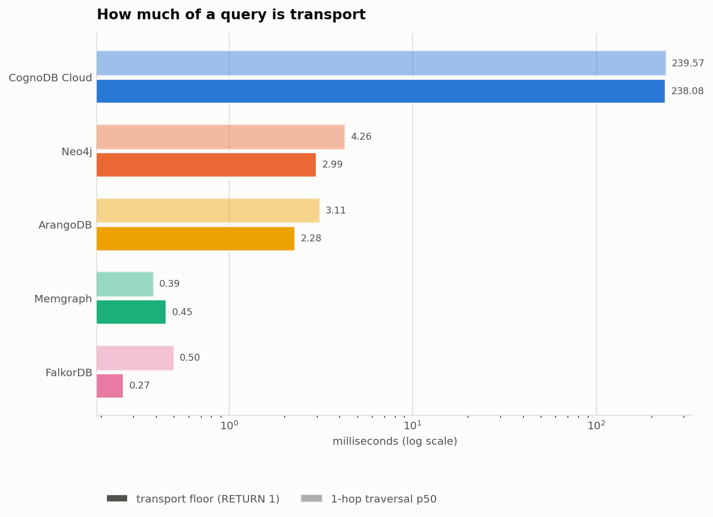

# Benchmark results

Run `20260820T171439Z` · generated from `results.json`.

## Environment

| Field | Value |
|---|---|
| Client machine | macOS-26.5.2-arm64-arm-64bit-Mach-O |
| Client CPUs | 8 |
| Python | 3.13.6 |
| Run started (UTC) | 2026-08-20T17:14:39.191886+00:00 |
| Iterations per read workload | 100 |
| Warm-up iterations | 20 |
| Read-suite repeats | 3 |
| Load batch size | 10000 |
| Concurrency levels | [1, 10, 40] |
| Mixed-workload read ratio | 0.8 |

## Dataset

| Field | Value |
|---|---|
| Source | [SNAP cit-HepTh (arXiv HEP-Th citation network)](https://snap.stanford.edu/data/cit-HepTh.html) |
| Nodes | 27,769 |
| Relationships | 352,768 |
| Sampled | False |
| Nodes with a known year | 11,444 (41.2%) |
| nodes.csv SHA-256 | `1f3b0b5d41e8b2f2…` |
| edges.csv SHA-256 | `0907ed5b2117de9d…` |

## Platforms and tier parity

| Platform | Query language | Tier | vCPU | RAM | Storage | Status |
|---|---|---|---|---|---|---|
| CognoDB Cloud | Cypher (Bolt) | Free (c0) | 0.5 vCPU (burstable) | 256 MB | 1 GB | completed |
| Neo4j | Cypher (Bolt) | Community 5.26, container-capped to parity tier | 0.5 vCPU (cgroup cpu quota) | 256 MB (cgroup memory limit) | 1 GB (dataset well under limit) | completed |
| Memgraph | Cypher (Bolt) | Memgraph 2.22 (in-memory transactional), container-capped | 0.5 vCPU (cgroup cpu quota) | 256 MB (cgroup memory limit) | 1 GB | completed |
| ArangoDB | AQL | ArangoDB 3.11 Community, container-capped | 0.5 vCPU (cgroup cpu quota) | 256 MB (cgroup memory limit) | 1 GB | completed |
| FalkorDB | Cypher (RESP/GraphBLAS) | FalkorDB 4.2 (Redis module), container-capped | 0.5 vCPU (cgroup cpu quota) | 256 MB (cgroup memory limit) | 1 GB | completed |

## Result parity check

Every read workload records the value it returned. If two platforms disagree, the queries are not equivalent and the latency comparison below is invalid.

| Workload | All platforms agree | Summed result per platform |
|---|---|---|
| 1-hop | yes | CognoDB Cloud=1,669, Neo4j=1,669, Memgraph=1,669, ArangoDB=1,669, FalkorDB=1,669 |
| 2-hop | yes | CognoDB Cloud=18,013, Neo4j=18,013, Memgraph=18,013, ArangoDB=18,013, FalkorDB=18,013 |
| 3-hop | yes | CognoDB Cloud=95,111, Neo4j=95,111, Memgraph=95,111, ArangoDB=95,111, FalkorDB=95,111 |
| point-lookup | yes | CognoDB Cloud=100, Neo4j=100, Memgraph=100, ArangoDB=100, FalkorDB=100 |
| filtered-lookup | yes | CognoDB Cloud=114,100, Neo4j=114,100, Memgraph=114,100, ArangoDB=114,100, FalkorDB=114,100 |
| aggregation | yes | CognoDB Cloud=1,200, Neo4j=1,200, Memgraph=1,200, ArangoDB=1,200, FalkorDB=1,200 |

## Transport baseline

| Platform | Transport p50 (ms) | Transport p95 (ms) | 1-hop p50 (ms) | Share of 1-hop that is transport |
|---|---|---|---|---|
| CognoDB Cloud | 238.08 | 309.77 | 239.57 | 99% |
| Neo4j | 2.99 | 86.70 | 4.26 | 70% |
| Memgraph | 0.45 | 0.72 | 0.39 | at floor |
| ArangoDB | 2.28 | 8.76 | 3.11 | 73% |
| FalkorDB | 0.27 | 0.43 | 0.50 | 53% |

## Ingest throughput

| Platform | Nodes/s | Rels/s | Total load (s) | Load method |
|---|---|---|---|---|
| CognoDB Cloud | 12,153 | 17,531 | 22.4 | official neo4j driver, UNWIND batching (batch=10000) |
| Neo4j | 1,163 | 5,421 | 89.0 | official neo4j driver, UNWIND batching (batch=10000) |
| Memgraph | 18,777 | 42,246 | 9.8 | official neo4j driver, UNWIND batching (batch=10000) |
| ArangoDB | 25,145 | 32,703 | 11.9 | python-arango insert_many batching (batch=10000) |
| FalkorDB | 19,829 | 35,320 | 11.4 | falkordb client, UNWIND batching (batch=10000) |

## Traversal latency

| Platform | 1-hop p50 | 1-hop p95 | 2-hop p50 | 2-hop p95 | 3-hop p50 | 3-hop p95 |
|---|---|---|---|---|---|---|
| CognoDB Cloud | 239.57 | 308.85 | 240.19 | 262.41 | 256.30 | 447.23 |
| Neo4j | 4.26 | 87.16 | 4.67 | 74.09 | 4.63 | 86.63 |
| Memgraph | 0.39 | 0.66 | 0.46 | 0.72 | 1.08 | 6.55 |
| ArangoDB | 3.11 | 54.25 | 4.86 | 79.06 | 16.50 | 175.72 |
| FalkorDB | 0.50 | 1.15 | 0.42 | 0.74 | 0.94 | 2.77 |

## Lookups and aggregation

| Platform | point p50 | point p95 | filtered p50 | filtered p95 | aggregation p50 | aggregation p95 | Indexed properties |
|---|---|---|---|---|---|---|---|
| CognoDB Cloud | 244.13 | 269.85 | 244.90 | 309.61 | 287.10 | 342.91 | Paper.paper_id, Paper.year, Paper.degree |
| Neo4j | 2.44 | 56.40 | 4.46 | 67.04 | 9.16 | 94.36 | Paper.paper_id, Paper.year, Paper.degree |
| Memgraph | 0.39 | 0.83 | 1.22 | 1.88 | 6.47 | 30.14 | Paper.paper_id, Paper.year, Paper.degree |
| ArangoDB | 2.06 | 2.71 | 6.06 | 14.04 | 7.48 | 36.80 | papers.paper_id, papers.year, papers.degree |
| FalkorDB | 0.58 | 3.30 | 0.69 | 0.82 | 4.04 | 23.11 | Paper.paper_id, Paper.year, Paper.degree |

## Mixed workload concurrency sweep

| Platform | Clients | QPS | p50 ms | p95 ms | p99 ms | Reads | Writes | Errors |
|---|---|---|---|---|---|---|---|---|
| CognoDB Cloud | 1 | 4.0 | 239.73 | 284.37 | 451.61 | 65 | 16 | 0 |
| CognoDB Cloud | 10 | 39.5 | 248.23 | 264.20 | 285.52 | 641 | 159 | 0 |
| CognoDB Cloud | 40 | 155.5 | 252.19 | 278.47 | 306.12 | 2514 | 634 | 0 |
| Neo4j | 1 | 178.2 | 1.64 | 27.83 | 78.86 | 2865 | 711 | 0 |
| Neo4j | 10 | 182.1 | 23.25 | 109.82 | 209.55 | 2939 | 705 | 0 |
| Neo4j | 40 | 239.4 | 104.93 | 302.45 | 485.84 | 3838 | 976 | 7 |
| Memgraph | 1 | 2,779.8 | 0.34 | 0.54 | 0.70 | 44544 | 11054 | 0 |
| Memgraph | 10 | 3,265.4 | 1.90 | 4.98 | 36.79 | 52490 | 12829 | 1 |
| Memgraph | 40 | 3,261.6 | 8.14 | 38.79 | 52.47 | 52324 | 12926 | 2 |
| ArangoDB | 1 | 268.0 | 3.88 | 5.35 | 6.60 | 4284 | 1076 | 0 |
| ArangoDB | 10 | 1,754.6 | 4.66 | 14.46 | 27.75 | 28311 | 6786 | 0 |
| ArangoDB | 40 | 1,730.4 | 20.60 | 44.88 | 60.00 | 27848 | 6802 | 0 |
| FalkorDB | 1 | 1,884.2 | 0.49 | 0.67 | 1.04 | 30194 | 7494 | 0 |
| FalkorDB | 10 | 1,756.9 | 1.42 | 68.40 | 78.24 | 28431 | 6816 | 0 |
| FalkorDB | 40 | 1,814.5 | 5.86 | 84.59 | 91.61 | 29296 | 7090 | 1027 |

## Cold start vs warm

First touch after load, before any warm-up, against the warm p50 for the same workload.

| Platform | Workload | Cold first-touch ms | Warm p50 ms |
|---|---|---|---|
| CognoDB Cloud | 1-hop | 237.62 | 239.57 |
| CognoDB Cloud | 3-hop | 361.00 | 256.30 |
| CognoDB Cloud | aggregation | 283.56 | 287.10 |
| Neo4j | 1-hop | 530.08 | 4.26 |
| Neo4j | 3-hop | 1,390.83 | 4.63 |
| Neo4j | aggregation | 501.08 | 9.16 |
| Memgraph | 1-hop | 7.90 | 0.39 |
| Memgraph | 3-hop | 9.20 | 1.08 |
| Memgraph | aggregation | 6.76 | 6.47 |
| ArangoDB | 1-hop | 16.77 | 3.11 |
| ArangoDB | 3-hop | 67.67 | 16.50 |
| ArangoDB | aggregation | 17.23 | 7.48 |
| FalkorDB | 1-hop | 188.63 | 0.50 |
| FalkorDB | 3-hop | 2.83 | 0.94 |
| FalkorDB | aggregation | 5.08 | 4.04 |

## Run-to-run variance

The read suite repeated end to end. Spread shows how much of any difference between platforms is just noise.

| Platform | Workload | Runs | p50 per run (ms) | Spread (ms) | Spread % |
|---|---|---|---|---|---|
| CognoDB Cloud | 1-hop | 3 | 239.57, 245.02, 243.16 | 5.45 | 2.2% |
| CognoDB Cloud | 2-hop | 3 | 240.19, 240.64, 240.93 | 0.74 | 0.3% |
| CognoDB Cloud | 3-hop | 3 | 256.30, 259.87, 263.85 | 7.55 | 2.9% |
| CognoDB Cloud | point-lookup | 3 | 244.13, 243.62, 239.86 | 4.28 | 1.8% |
| CognoDB Cloud | filtered-lookup | 3 | 244.90, 246.02, 247.01 | 2.11 | 0.9% |
| CognoDB Cloud | aggregation | 3 | 287.10, 290.08, 290.98 | 3.88 | 1.3% |
| Neo4j | 1-hop | 3 | 4.26, 2.06, 1.60 | 2.66 | 100.7% |
| Neo4j | 2-hop | 3 | 4.67, 2.41, 1.81 | 2.85 | 96.3% |
| Neo4j | 3-hop | 3 | 4.63, 4.25, 3.06 | 1.57 | 39.6% |
| Neo4j | point-lookup | 3 | 2.44, 2.03, 1.58 | 0.85 | 42.4% |
| Neo4j | filtered-lookup | 3 | 4.46, 4.38, 3.72 | 0.74 | 17.8% |
| Neo4j | aggregation | 3 | 9.16, 7.46, 8.39 | 1.71 | 20.5% |
| Memgraph | 1-hop | 3 | 0.39, 0.85, 0.77 | 0.47 | 69.8% |
| Memgraph | 2-hop | 3 | 0.46, 0.95, 0.89 | 0.49 | 64.3% |
| Memgraph | 3-hop | 3 | 1.08, 1.70, 1.56 | 0.62 | 42.9% |
| Memgraph | point-lookup | 3 | 0.39, 0.81, 0.70 | 0.42 | 66.1% |
| Memgraph | filtered-lookup | 3 | 1.22, 1.58, 1.52 | 0.37 | 25.4% |
| Memgraph | aggregation | 3 | 6.47, 6.62, 6.45 | 0.17 | 2.6% |
| ArangoDB | 1-hop | 3 | 3.10, 2.75, 2.48 | 0.63 | 22.5% |
| ArangoDB | 2-hop | 3 | 4.86, 4.05, 2.82 | 2.04 | 52.1% |
| ArangoDB | 3-hop | 3 | 16.50, 13.82, 13.87 | 2.68 | 18.2% |
| ArangoDB | point-lookup | 3 | 2.06, 2.69, 2.23 | 0.62 | 26.8% |
| ArangoDB | filtered-lookup | 3 | 6.06, 6.28, 6.31 | 0.26 | 4.1% |
| ArangoDB | aggregation | 3 | 7.48, 7.75, 7.63 | 0.27 | 3.5% |
| FalkorDB | 1-hop | 3 | 0.50, 0.47, 0.62 | 0.15 | 27.8% |
| FalkorDB | 2-hop | 3 | 0.42, 0.55, 0.63 | 0.22 | 40.5% |
| FalkorDB | 3-hop | 3 | 0.94, 0.94, 0.91 | 0.03 | 2.9% |
| FalkorDB | point-lookup | 3 | 0.58, 0.54, 0.54 | 0.04 | 6.9% |
| FalkorDB | filtered-lookup | 3 | 0.69, 0.77, 0.77 | 0.08 | 10.9% |
| FalkorDB | aggregation | 3 | 4.04, 4.01, 3.93 | 0.11 | 2.7% |

## Footprint

| Platform | Nodes stored | Rels stored | Load complete | Observable footprint |
|---|---|---|---|---|
| CognoDB Cloud | 27,769 | 352,768 | yes | not observable (JMX store metrics unavailable on this tier) |
| Neo4j | 27,769 | 352,768 | yes | not observable (JMX store metrics unavailable on this tier) |
| Memgraph | 27,769 | 352,768 | yes | memory_res=179.58MiB, disk_usage=28.44MiB, vertex_count=27,769, edge_count=352,768 |
| ArangoDB | 27,769 | 352,768 | yes | papers_documents=27,769, papers_documents_bytes=2,324,750, cites_documents=352,768, cites_documents_bytes=31,574,099, index_bytes=40,160,720, total_stored_bytes=74,059,569 |
| FalkorDB | 27,769 | 352,768 | yes | used_memory_bytes=32,515,984, used_memory_human=31.01M, used_memory_peak_bytes=79,209,216 |
